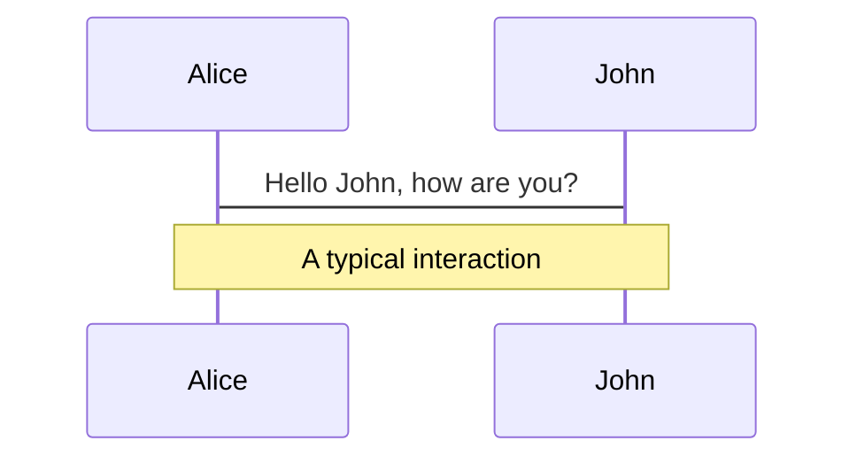
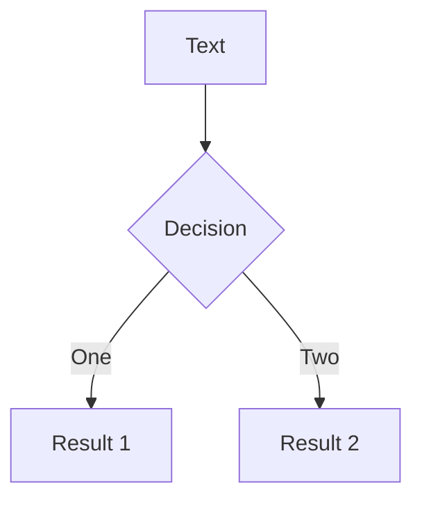

# BigDataX Final Presentation

By: Matthew Chen \
Advised by: Tyler Skluzacek and Kyle Chard


---
theme: apple-basic
layout: image-right
image: "./images/XtractData.PNG"

---

# Introduction

Xtract is a distributed metadata extraction service designed to reduce extraction time and data transfer costs.

* ⌛ + 💰 **Scheduler** - High performance computers --> limited compute time 
  - Given fixed budget extract as much metadata as fast as possible

* 🔎📄 **Survey of File Type Identification Methods** 
  - Clustering (K-means, Hierarchical) + Visualization (PCA, kPCA, T-SNE)
  - ML-Methods (Xtract-Sampler's Logistic Regression, Support Vector Machines, and Random Forests)
  - Deep Learning Methods - Convolutional Neural Networks (In Progress)


---
layout: image-right
image: "./images/combine_images.png"
---

# Motivation + Literature Review
<span font-size=4em>
<ul>
 <li> File type identification is a growing subfield within the field of digital forensics</li>
 <li> "Content Based File Type Detection Algorithms" McDaniel and Heydari (2002) </li>
 <li> Analyzed notably Byte Frequency Distributions and File Header/Trailer's </li>
 <li> State of art paper: Systematic Classification Engine for Advanced Data Analysis (SCEADAN) by Beebe et. al in 2014</li>
 <li> Achieved approximately 75% classification accuracy on over 30 different file types w/ only BFDs and SVMs</li>
</ul>
</span>

---
layout: quote
---

 ## "Although several researchers have been focused on the development of new methods to improve the quality of the data stored in research data repositories ... there is little research on the data quality issues of the metadata used to describe and annotate datasets in this type of repositories. The use of complete and accurate metadata is important for several processes, including the re-use and sharing of research datasets among scientists; the application of digital curation and data provenance strategies; and the analysis of the contents of research data repositories."

- Rousidis and Garoufallou ("Metadata for Big Data: A preliminary investigation of metadata quality issues in research data repositories", 2014)


---
layout: image-right
image: "./images/bfd.PNG" 
---
# Methods - Data
## Byte Frequency Distributions
### 1-grams
- Frequency of bytes (0x00 to 0xFF) per file (256 values)
### 2-grams
- Frequency of pairs of bytes (0x00-0x01 to 0xFF-0xFF) (65336 values)
## Byte Vectors
- Simply the first X amount of bytes from a head i.e. ([234, 18, 0, 16, ...]) 
- Widely used in literature as an accurate metric for identification + Xtract-Sampler


---
layout: image-right
image: "./images/KmeansFail.PNG"

---
# Methods - Clustering
## Feature Reduction
### PCA, kPCA, Feature Agglomeration
- Given the number of dimensions clustering is required for visualization
- PCA (Linear) vs. kPCA + Feature Agglomeration (Non-Linear)
## Clustering
### K-Means and Hierarchical Clustering
- Popular clustering methods used in an unsupervised setting
- Compared to true labels misidentified them (ineffective)

---
layout: image-right
image: "./images/TSNEBadReal.PNG"
---

# Methods - Visualization 

- When all other methods failed T-Distributed Stochastic Neighborhood Embedding (T-SNE) proved useful
  - Mainly used for visualizing higher dimensional data
  - Non-Linear method
  - Approximates distances via probabilities of how close two points should be to one another


---

# Methods - Xtract Sampler

- Within Xtract's service the sampler implements various machine learning methods in `sklearn` including Support Vector Machines (SVMs), Logistic Regression, and Random Forests (RFs) to predict the best extractor for the file
  - Use byte vectors (Typically 512 bytes from the head) to predict file
  - High Accuracy at around 70% to 95% accuracy 

```ts {1|2|all}
    prediction = trained_classifier.predict(x)
    prediction_probabilities = probability_dictionary(trained_classifier.predict_proba(x)[0], label_map)
```
  - Precision, Recall, and ROC (Reciever Operating Characteristic) Curves demonstrate effective classification with few false positives/negatives  
  
- Exhaustive search of classifier's hyperparameters to find best accuracy, precision, and recall

---
layout: two-cols
---

<template v-slot:default>

# Methods - Xtract Scheduler

- Given a constrained computational budget the scheduler attempts to maximize the amount of metadata extract in the least amount of time
- For testing and experimentation the Carbon Dioxide Information Analysis Center (CDIAC) Pub8 is used 
- Propose a metric for maximizing amount of metadata per second
- Simulate effectiveness
  - Extracted metadata already known before scheduler

</template>
<template v-slot:right>

## Objective Function: 

$$ \alpha(F) = S(F) \circ P(F) \circ \frac{1}{T(F)} $$

- where $\circ$ represents the Hadamard Product (pairwise multiplication), $S$ represents the vector of predicted sizes of metadata files, $P$ represents a vector of probabilities for how effective each extractor will work on the file, and $T$ represents the vector of estimated times for a file
- the function takes in a file and outputs a vector of length equal to the number of extractors available + 1 for the unknown extractor


</template>

---
---

# Navigation

Hover on the bottom-left corner to see the navigation's controls panel, [learn more](https://sli.dev/guide/navigation.html)

---
---
layout: image-right
image: https://source.unsplash.com/collection/94734566/1920x1080
---

# Code

Use code snippets and get the highlighting directly![^1]

```ts {all|2|1-6|9|all}
interface User {
  id: number
  firstName: string
  lastName: string
  role: string
}

function updateUser(id: number, update: User) {
  const user = getUser(id)
  const newUser = {...user, ...update}  
  saveUser(id, newUser)
}
```

<arrow v-click="3" x1="400" y1="420" x2="230" y2="330" color="#564" width="3" arrowSize="1" />

[^1]: [Learn More](https://sli.dev/guide/syntax.html#line-highlighting)

<style>
.footnotes-sep {
  @apply mt-20 opacity-10;
}
.footnotes {
  @apply text-sm opacity-75;
}
.footnote-backref {
  display: none;
}
</style>

---

# Components

<div grid="~ cols-2 gap-4">
<div>

You can use Vue components directly inside your slides.

We have provided a few built-in components like `<Tweet/>` and `<Youtube/>` that you can use directly. And adding your custom components is also super easy.

```html
<Counter :count="10" />
```

<!-- ./components/Counter.vue -->
<Counter :count="10" m="t-4" />

Check out [the guides](https://sli.dev/builtin/components.html) for more.

</div>
<div>

```html
<Tweet id="1390115482657726468" />
```

<Tweet id="1390115482657726468" scale="0.65" />

</div>
</div>


---
class: px-20
---

# Themes

Slidev comes with powerful theming support. Themes can provide styles, layouts, components, or even configurations for tools. Switching between themes by just **one edit** in your frontmatter:

<div grid="~ cols-2 gap-2" m="-t-2">

```yaml
---
theme: default
---
```

```yaml
---
theme: seriph
---
```


</div>

Read more about [How to use a theme](https://sli.dev/themes/use.html) and
check out the [Awesome Themes Gallery](https://sli.dev/themes/gallery.html).

---
preload: false
---

# Animations

Animations are powered by [@vueuse/motion](https://motion.vueuse.org/).

```html
<div
  v-motion
  :initial="{ x: -80 }"
  :enter="{ x: 0 }">
  Slidev
</div>
```

<div class="w-60 relative mt-6">
  <div class="relative w-40 h-40">
    
    
    
  </div>

  <div 
    class="text-5xl absolute top-14 left-40 text-[#2B90B6] -z-1"
    v-motion
    :initial="{ x: -80, opacity: 0}"
    :enter="{ x: 0, opacity: 1, transition: { delay: 2000, duration: 1000 } }">
    Slidev
  </div>
</div>

<!-- vue script setup scripts can be directly used in markdown, and will only affects current page -->
<script setup lang="ts">
const final = {
  x: 0,
  y: 0,
  rotate: 0,
  scale: 1,
  transition: {
    type: 'spring',
    damping: 10,
    stiffness: 20,
    mass: 2
  }
}
</script>

<div
  v-motion
  :initial="{ x:35, y: 40, opacity: 0}"
  :enter="{ y: 0, opacity: 1, transition: { delay: 3500 } }">

[Learn More](https://sli.dev/guide/animations.html#motion)

</div>

---

# LaTeX

LaTeX is supported out-of-box powered by [KaTeX](https://katex.org/).

<br>

Inline $\sqrt{3x-1}+(1+x)^2$

Block
$$
\begin{array}{c}

\nabla \times \vec{\mathbf{B}} -\, \frac1c\, \frac{\partial\vec{\mathbf{E}}}{\partial t} &
= \frac{4\pi}{c}\vec{\mathbf{j}}    \nabla \cdot \vec{\mathbf{E}} & = 4 \pi \rho \\

\nabla \times \vec{\mathbf{E}}\, +\, \frac1c\, \frac{\partial\vec{\mathbf{B}}}{\partial t} & = \vec{\mathbf{0}} \\

\nabla \cdot \vec{\mathbf{B}} & = 0

\end{array}
$$

<br>

[Learn more](https://sli.dev/guide/syntax#latex)

---

# Diagrams

You can create diagrams / graphs from textual descriptions, directly in your Markdown.

<div class="grid grid-cols-2 gap-10 pt-4 -mb-6">





</div>

[Learn More](https://sli.dev/guide/syntax.html#diagrams)


---
layout: center
class: text-center
---

# Learn More

[Documentations](https://sli.dev) · [GitHub](https://github.com/slidevjs/slidev) · [Showcases](https://sli.dev/showcases.html)
