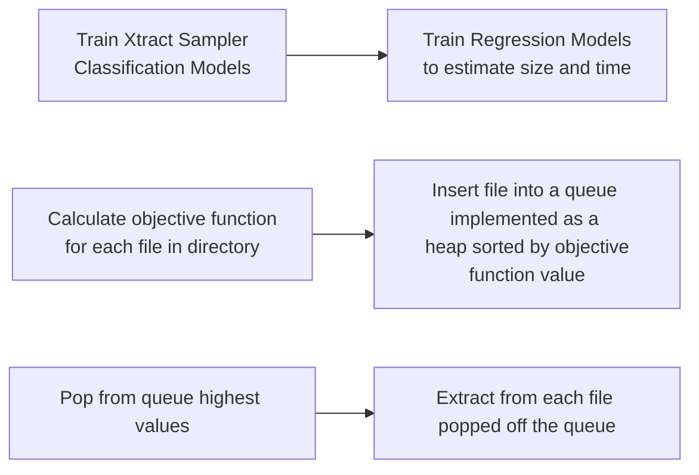

# BigDataX Final Presentation

By: Matthew Chen \
Advised by: Tyler Skluzacek and Kyle Chard


---
theme: apple-basic
layout: image-right
image: "./images/XtractData.PNG"

---

# Introduction

Xtract is a distributed metadata extraction service designed to reduce extraction time and data transfer costs.

* ⌛ + 💰 **Scheduler** - High performance computers --> limited compute time 
  - Given fixed budget extract as much metadata as fast as possible

* 🔎📄 **Survey of File Type Identification Methods** 
  - Clustering (K-means, Hierarchical) + Visualization (PCA, kPCA, T-SNE)
  - ML-Methods (Xtract-Sampler's Logistic Regression, Support Vector Machines, and Random Forests)
  - Deep Learning Methods - Convolutional Neural Networks (In Progress)


---
layout: image-right
image: "./images/combine_images.png"
---

# Motivation + Literature Review
<span font-size=4em>
<ul>
 <li> File type identification is a growing subfield within the field of digital forensics</li>
 <li> "Content Based File Type Detection Algorithms" McDaniel and Heydari (2002) </li>
 <li> Analyzed notably Byte Frequency Distributions and File Header/Trailer's </li>
 <li> State of art paper: Systematic Classification Engine for Advanced Data Analysis (SCEADAN) by Beebe et. al in 2014</li>
 <li> Achieved approximately 75% classification accuracy on over 30 different file types w/ only BFDs and SVMs</li>
</ul>
</span>

---
layout: quote
---

 ## "Although several researchers have been focused on the development of new methods to improve the quality of the data stored in research data repositories ... there is little research on the data quality issues of the metadata used to describe and annotate datasets in this type of repositories. The use of complete and accurate metadata is important for several processes, including the re-use and sharing of research datasets among scientists; the application of digital curation and data provenance strategies; and the analysis of the contents of research data repositories."

- Rousidis and Garoufallou ("Metadata for Big Data: A preliminary investigation of metadata quality issues in research data repositories", 2014)


---
layout: image-right
image: "./images/bfd.PNG" 
---
# Methods - Data
## Byte Frequency Distributions
### 1-grams
- Frequency of bytes (0x00 to 0xFF) per file (256 values)
### 2-grams
- Frequency of pairs of bytes (0x00-0x01 to 0xFF-0xFF) (65336 values)
## Byte Vectors
- Simply the first X amount of bytes from a head i.e. ([234, 18, 0, 16, ...]) 
- Widely used in literature as an accurate metric for identification + Xtract-Sampler


---
layout: image-right
image: "./images/KmeansFail.PNG"

---
# Methods - Clustering
## Feature Reduction
### PCA, kPCA, Feature Agglomeration
- Given the number of dimensions clustering is required for visualization
- PCA (Linear) vs. kPCA + Feature Agglomeration (Non-Linear)
## Clustering
### K-Means and Hierarchical Clustering
- Popular clustering methods used in an unsupervised setting
- Compared to true labels misidentified them (ineffective)

---
layout: image-right
image: "./images/TSNEBadReal.PNG"
---

# Methods - Visualization 

- When all other methods failed T-Distributed Stochastic Neighborhood Embedding (T-SNE) proved useful
  - Mainly used for visualizing higher dimensional data
  - Non-Linear method
  - Approximates distances via probabilities of how close two points should be to one another


---

# Methods - Xtract Sampler

- Within Xtract's service the sampler implements various machine learning methods in `sklearn` including Support Vector Machines (SVMs), Logistic Regression, and Random Forests (RFs) to predict the best extractor for the file
  - Use byte vectors (Typically 512 bytes from the head) to predict file
  - High Accuracy at around 70% to 95% accuracy 

```ts {1|2|all}
    prediction = trained_classifier.predict(x)
    prediction_probabilities = probability_dictionary(trained_classifier.predict_proba(x)[0], label_map)
```
  - Precision, Recall, and ROC (Reciever Operating Characteristic) Curves demonstrate effective classification with few false positives/negatives  
  
- Exhaustive search of classifier's hyperparameters to find best accuracy, precision, and recall

---
layout: two-cols
---

<template v-slot:default>

# Methods - Xtract Scheduler

- Given a constrained computational budget the scheduler attempts to maximize the amount of metadata extract in the least amount of time
- For testing and experimentation the Carbon Dioxide Information Analysis Center (CDIAC) Pub8 is used 
- Propose a metric for maximizing amount of metadata per second
- Simulate effectiveness
  - Extracted metadata already known before scheduler

</template>
<template v-slot:right>

## Objective Function: 

$$ \alpha(F) = S(F) \circ P(F) \circ \frac{1}{T(F)} $$

- where $\circ$ represents the Hadamard Product (pairwise multiplication), $S$ represents the vector of predicted sizes of metadata files, $P$ represents a vector of probabilities for how effective each extractor will work on the file, and $T$ represents the vector of estimated times for a file
- the function takes in a file and outputs a vector of length equal to the number of extractors available + 1 for the unknown extractor
- *Conceptually the objective function calculates expected amount of metadata per second*

</template>

---
---

# Methods - Xtract Scheduler (cont.)

- Various regression techniques from `sklearn` were used to estimate the expected size of metadata generated and time taken from extraction using data from extracting CDIAC's Pub8
```ts {all|1|6|all}
pipelines.append(('ScaledLR', Pipeline([('Scaler', StandardScaler()),('LR',LinearRegression())])))
pipelines.append(('ScaledLASSO', Pipeline([('Scaler', StandardScaler()),('LASSO', Lasso())])))
pipelines.append(('ScaledEN', Pipeline([('Scaler', StandardScaler()),('EN', ElasticNet())])))
pipelines.append(('ScaledKNN', Pipeline([('Scaler', StandardScaler()),('KNN', KNeighborsRegressor())])))
pipelines.append(('ScaledCART', Pipeline([('Scaler', StandardScaler()),('CART', DecisionTreeRegressor())])))
pipelines.append(('ScaledGBM', Pipeline([('Scaler', StandardScaler()),('GBM', GradientBoostingRegressor())])))

for name, model in pipelines:
    kfold = KFold(n_splits=10, random_state=42, shuffle=True)
    cv_results = cross_val_score(model, X_train, Y_train, cv=kfold, scoring='neg_mean_squared_error')
```
- For some xtractors data was log-scaled to provide better fits/less loss 

- Linear Regression and Gradient Boosted Regression worked best


---
---
# Methods - Xtract Scheduler (cont.)


### Workflow:



### Note:
For the last step, multiple worker processes are generated for faster extraction


---
layout: image-right
image: "./images/ByteHeadSize.PNG"
---

# Experimentation

- In each of these methods 6 extractors were used:
  - Image
  - Tabular
  - Keyword
  - NetCDF
  - JSON/XML
  - "Unknown"

- For clustering variable sizes of byte heads were extracted:
  - 256B, 512B, 1024B, 256KB, 512KB, 1MB
- For the sampler only 512 bytes from the head were used

---

# Results - Clustering

- T-SNE proved to be the only viable method of visualization + attempting to cluster in a 2-3 dimensional space
- PCA and k-PCA could not handle the extreme amount of variance in each of the features
  - Even with 3 dimensions PCA only could have approximately a 60% explained variance ratio
  - T-SNE circumvents this but still only works in 3D
- Byte Vectors proved to be just as effective as Byte Frequency Distributions in True-Label Clustering
  - Size reductions all the way down to 1024 Bytes analyzed did not effect clustering
- K-Means and Agglormerative Clustering failed to identify true clusters
  - Silohouette scores for K-means were 10x than true label scores, but had only around 30-40% accuracy in grouping clusters properly

---
layout: 3-images
imageLeft: './images/TWOGRAMTSNE256KBVEC.PNG'
imageTopRight: './images/TwoGramTSNE512KBBFD.PNG'
imageBottomRight: './images/KMEANSTwogramTSNE512KBBFD.PNG'

---
### Left is Two Gram 256 KB on Byte Vector, Top right is Two gram 512KB on BFD with Bottom Right a K-means on it
---
---
# Results - Xtract Sampler

- Hyperparameters tuning did not really find any significant improvements
  - Logistic Regression and SVM sometimes did not converge yet still showed high accuracy (70%-90%)
  - Several parameters were found to be infeasible due to their long computation time
  - Generally, more iterations of training increased accuracy at the cost of time
- Plotted Confusion Matrix, Precision, Recall and ROC curves demonstrate validity of Xtract Sampler
  - SVM shown to benefit more from examining less bytes while other classifiers shown to have converge in classification accuracy

---
layout: 3-images
imageLeft: "./images/RF Confusion Matrix No Normalize.png"
imageTopRight: "./images/ByteHeadSize.PNG"
imageBottomRight: "./images/SVC Confusion Matrix No Normalize.png"

---
---

# Results - Xtract Scheduler

- The specified constants for the "Unknown" extractor enabled for the scheduler to decide that only a few files (approximately 80) were unidentified/have unidentified as the best option  
- On a Chameleon Cloud node with Intel Xeon Gold 6126:
  - Crawling through the repository using Xtract crawler and building the queue for Pub8 takes 20 minutes
  - Simulating the file extraction with 48 worker processes (48 cores on machine) takes 11 seconds!
    - Only extracting on the first best metadata extractor 
  - NetCDF seems to be the most difficult to optimize
    - Scheduler considered that other extractors were best first for NetCDF files 


---
---
# Scheduler Preliminary Results

### Multi-worker times
``` ts 
start_time = time.time()
iterations = mp.Value("i", 0)
lock = mp.Lock()
processes=[mp.Process(target=simulate_single_file_extraction, args=(queue, iterations, lock, ExtractionTimes, ExtractionSizes)) for x in range(0, mp.cpu_count())]
for p in processes:
    p.start()
for p in processes:
    p.join()
print("--- %s seconds ---" % (time.time() - start_time))

<Synchronized wrapper for c_int(48)>
--- 11.376144170761108 seconds ---

```
### Identified files via the scheduler
```ts
Unknown Extractor:  73
Best Extractor is empty:  7
Keywords: 2935
Tabular: 6196
JSONXML: 3180
NetCDF: 0
Image: 7978
```
---
---
# Discussion of results

- Clustering 
  - Results align with recent paper by Sester et. al 2021
    - For 2-grams clustering was shown to be much better using non-linear methods
    - 1-gram linear feature reduction worked best, but non-linear worked decently
  - High variance between the bytes regardless of BFDs or Byte Head Analyses makes visualization in lower dimensions extremely difficult 
- Xtract-Sampler
  - Validated the results that Tyler published on Xtract-Sampler
  - Produced confusion matrices and introduced precision and recall metrics 

---
---

# Discussion of results (cont.)

- Scheduler optimizes well for identifying the first extractor
  - Need to still compare with naive method of extracting using Xtract w/o scheduler 
  - Successfully reduces the amount of "unknown" extractions
  - Experiment on scheduling with different time constraints

- Test scheduler with by including another objective function:

$$\alpha(F) = S(F) \cdot P(F) \cdot \frac{1}{T(F)} $$

- where $\cdot$ represents a dot product between the vectors and this time the vectors DO NOT include unknown extractors
- the unknown extractor objective funciton value is factored in as the sum of all the other extractors
- This cost function helps discern the problem of whether or not one should focus on getting huge amounts of metadata from a singular file or several small amounts of metadata from a small file

---
---

# Future Work

- Survey of File Type Identification Methods
  - Convolutional Neural Networks 
    - Can only achieve 4% accuracy despite published literature on at least 80% 
    - Experiment with GPU-accelerated training 

- Scheduler 
  - Actually integrate Scheduler on Xtract web-service 
    - Perform non-simulated benchmarks
  - Apply scheduler to actual time constraints

- Want to publish these two as seperate works?

# Conclusion 


